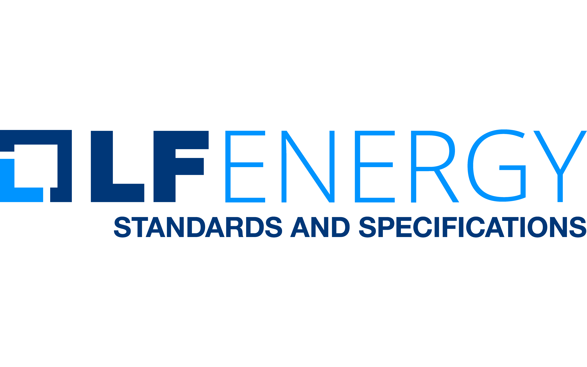

[](https://github.com/trolie/spec/actions/workflows/lint.yaml)
[](https://github.com/trolie/spec/actions/workflows/owasp.yaml)

# TROLIE 1.0 Specification Working Group



The Transmission Ratings and Operating Limits Information Exchange (TROLIE) 1.0
specification is an LF Energy Standards and Specification Working Group. The
official website is [trolie.energy](https://trolie.energy).


## Scope

The aim of the Working Group is to facilitate interoperability for organizations implementing FERC Order 881. In particular we are developing an [OpenAPI Specification](https://trolie.energy/spec). Please see [Scope](./Scope.md) for a thorough description of the Working Group's charge.

## License

The OpenAPI specification is licensed under the [Community Specification License 1.0](Community_Specification_License.md).

Source code is otherwise licensed under [Apache 2.0](https://opensource.org/license/apache-2-0).

For more details see [LICENSE.md](LICENSE.md).

## Contributing

There are three roles for contributors: Maintainers, Editors, and Participants. See the [Governance Policy](Governance.md).

All contributions to the TROLIE Specification 1.0 Working Group are done under the [Community Specification Contributor License Agreement](Contributor_License_Agreement.md).

### Compiling the Site and Specification Locally

The `docs/` folder contains a Jekyll site for the GH Pages along with the yaml
that is used with `redocly bundle` to create the OpenAPI specification.

To simplify the local setup of the toolchain, a devcontainer is provided. This
will also install VS Code extensions to help with local editing.

#### Self-Signed Certs and Repo Proxies

If your company uses MITM, self-signed certificates through your Internet proxy
and/or proxies upstream RubyGem or npm repos, please follow these instructions
to get the local devcontainer editing experience working.

Put your company's self-signed cert in a PEM file at: `.devcontainer/root.pem`

You can use your company's RubyGem and npm proxies by specifying them in
`.devcontainer\devcontainer.json` by replacing:

```json
  "containerEnv": {
      "GEM_REPO": "https://rubygems.org",
      "NPM_CONFIG_REGISTRY": "https://registry.npmjs.org"
  }
```
