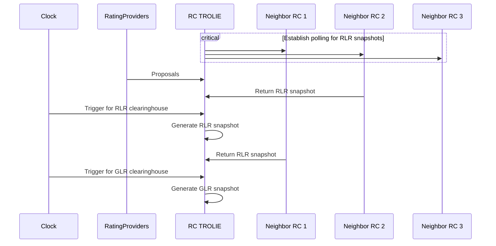
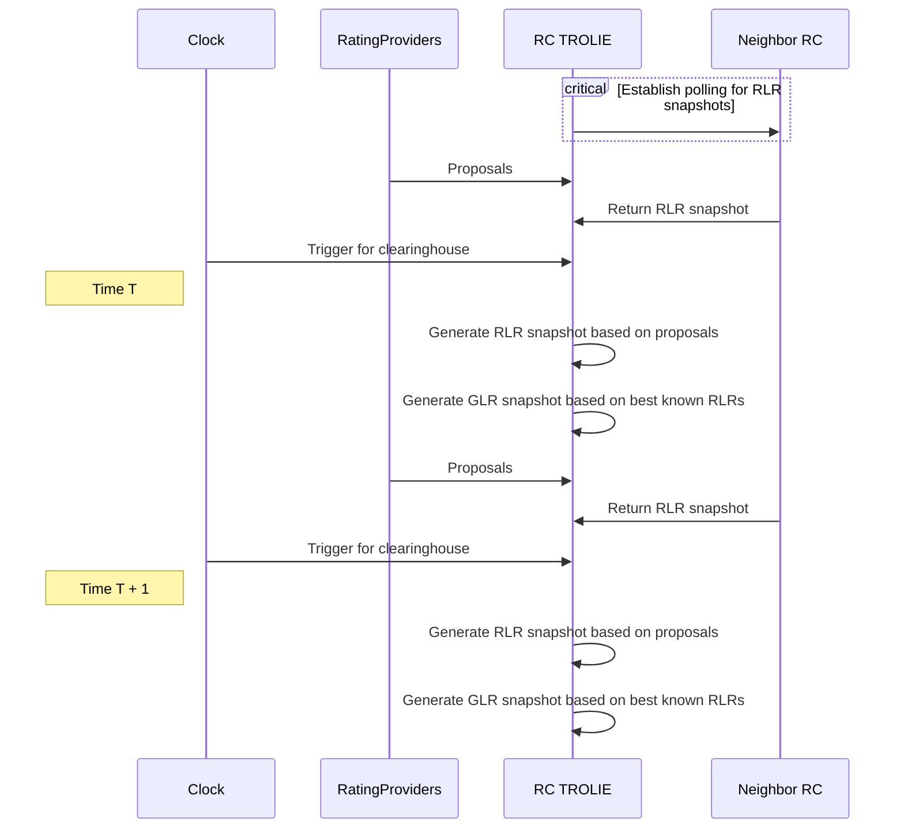

# Reconciling AARs on RC-RC Interties

In TROLIE's simplest usage, rating providers send rating proposals to Transmission Providers
using the workflow described in [Forecast Submittal](../example-narratives/submitting-forecasts.md).  

However, two neighboring Transmission Providers, each running independent clearinghouses, will also
have to share ratings.  Each TROLIE server must be able to act as a client to achieve this coordination, 
with each reaching out to one another.  These Transmission Providers also serve in the NERC role of 
Reliability Coordinator (RC), which will be the term used throughout this article.  

This article specifically covers reconciling ratings between two clearinghouses.  It builds off of the
[peer-monitoring-sets](./peer-monitoring-sets.md) article and assumes that monitoring sets between peers
have been reconciled.  

This article defines a design pattern recommended as a best practice, as it ultimately must 
be implemented within TROLIE servers and is only supported by the TROLIE communications specification 
rather than mandated by it.  

# Globally Limiting Ratings at the Seams
For most facilities in a reliability coordinator (RC) footprint, the output of the clearinghouse represents
Globally Limiting Ratings or [GLRs](../concepts.md#globally-limiting-rating) that may be used in 
operations.  However, most RCs don't exist on electrical islands by themselves.  They will have interties
with neighboring RCs.  Assuming each RC is running its own clearinghouse, or is otherwise generating its
ratings independently, GLRs for these facilities must be resolved after clearinghouse runs in a separate phase.  

# Reconciling Forecast ClearingHouse Results
In terms of TROLIE mechanics, the initial output of each RC's clearinghouse is considered the 
[Regionally Limiting Rating](../concepts.md#regionally-limiting-rating) or RLR.  Peer TROLIEs can continuously 
poll each other for new RLRs using the 
[getRegionalLimitsForecastSnapshot](../spec#tag/Forecasting/operation/getRegionalLimitsForecastSnapshot) 
operation.  

After receiving RLRs from all neighbors in addition to generating its own, the TROLIE instance can generate a regular
snapshot that consists of [Globally Limiting Ratings](../concepts.md#globally-limiting-rating) or GLRs, that incorporate
the most conservative RLRs for each facility.  Only these GLR snapshots should be visible via 
[getLimitsForecastSnapshot](../spec#tag/Forecasting/operation/getLimitsForecastSnapshot), which represents the final
ratings that may be used in key decisions such as markets, look-ahead unit commitment and dispatch, and outage
coordination.  

Consider the following sequence for a particular forecast interval.  Note that certain events can easily occur out of order, 
as each neighbor's system will be making the same forecast decisions at slightly different times:

Each of the steps above deserves some more context.  The following listing describes each event, referencing the 
sequence numbers in the diagram above:

1.  The RC TROLIE server needs to poll for new RLRs against Neighbor RC 1.  This leverages the [Conditional GET](./conditional-GET.md) pattern, against [getRegionalLimitsForecastSnapshot](../spec#tag/Forecasting/operation/getRegionalLimitsForecastSnapshot).  
2.  Same as #1 for Neighbor RC 2
3.  Same as #1 for Neighbor RC 3
4.  Ratings Providers submit proposals, or [LLRs](../concepts.md#locally-limiting-rating), to TROLIE to be processed by the clearinghouse.  
5.  Neighbor RC 2 may clear its RLRs before the RC TROLIE is ready to clear its own RLRs.  The RC TROLIE must account for this in its design.  
6.  At an appointed time, the forecast clearinghouse for RLRs starts.  All proposals for that forecast window _should_ have been submitted.  
7.  RC TROLIE generates a forecast snapshot with RLRs.  It is available for other neighbor RCs to query.  
8.  Neighbor RC 1 clears its RLRs, shortly after they are cleared in the RC TROLIE.  RC TROLIE becomes aware of this for use in generating GLRs.  
9.  At an appointed time, the forecast clearinghouse for GLRs starts.  All RLR forecasts from neighboring RCs _should_ have been created and be visible to the RC TROLIE.  
10.  RC TROLIE generates GLR snapshot, that makes deltas to its original RLR snapshot, accommodating the RLR snapshots it received from Neighbor RCs 1 and 2.  Note that it never received anything from RC 3.  This is a contingency that the RC TROLIE must handle.  If RC 3 doesn't generate a forecast on time, then the RC TROLIE should be explicitly aware of that and engage in whatever recourse logic necessary to handle missing data from RC 3.  

# Reconciling Real-Time ClearingHouses
Reconciling forecast ratings is particularly challenging, because the difference between RLRs and 
GLRs must be reconciled for each discrete [Forecast Window](./forecast-windows.md).  

Real-time however is more of an eventually consistent flow, constantly converging.  This is because 
there is no "target" window for a given rating.  Rather, the value of the rating in use _now_ is 
constantly being updated, based on the best knowledge a given RC has about the RLRs of the other 
RC.  Like forecast, there is a dedicated operation 
[getRegionalRealTimeLimits](../spec#tag/Real-Time/operation/getRegionalRealTimeLimits) to facilitate
polling by the peers.  However, rather than wait for new RLR values, the clearinghouse can 
immediately generate new GLRs.  

See the following sequence for an example:

At any given time, the clearinghouse is simply using the most recent version of the RLRs
it has from neighbors in determining the GLRs.  During each clearinghouse run, the 
age of neighboring RLRs, as well as real-time proposals, should be validated for age,
and recourse methodologies triggered if they are too old.  

# Monitoring the RC to RC Seam
The interactions described above can and should be monitored for latency, as well as the 
absence of expected events such as missing RLR forecast snapshots from a particular peer.  

In addition, the derived seam monitoring set between peers, 
described [here](./peer-monitoring-sets.md#seam-monitoring-sets), may be used to do more 
thorough functional validations that multiple TROLIEs are configured and behaving 
correctly.  Specifically, the following conditions must be true:

* Since both TROLIEs are generating seam monitoring sets, these monitoring sets should represent the same set of resources.  The monitoring sets should have the same size, and each resource should have an alias that maps to the primary identifier or one of the aliases in the other monitoring set.  
* For a given forecast window, the result of [getLimitsForecastSnapshot](../spec#tag/Forecasting/operation/getLimitsForecastSnapshot) (the GLRs) should be identical in each TROLIE.  