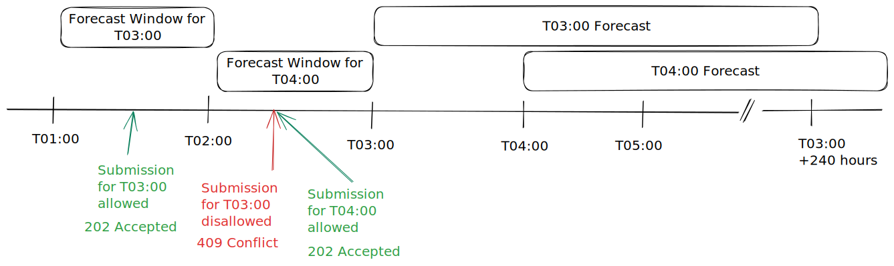
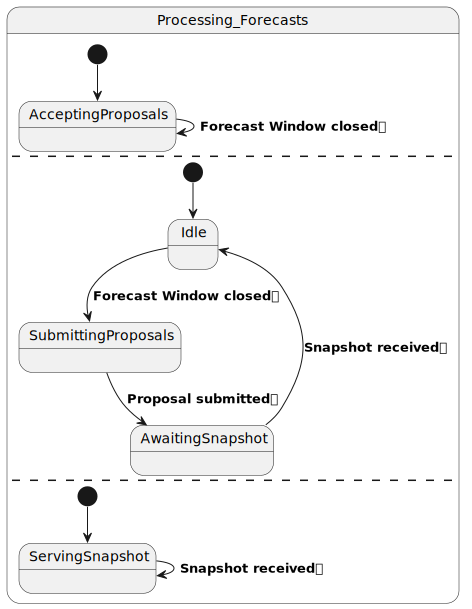

# Forecast Windows

## Overview

Subsequent to receiving ratings, the Clearinghouse Provider must process and
disseminate the Limits Forecast. To ensure the Forecast is available to the
appropriate downstream internal processes and external entities on-time, a
delivery deadline must be established for the Ratings Providers. Moreover, per
Order 881, it is incumbent upon the Ratings Provider to produce a new Ratings
Forecast every hour using an updated forecast of ambient conditions.
Consequently, there is also a limit to how early a Ratings Forecast should be
generated and proposed to the Clearinghouse Provider.

The following timeline illustrates Forecast Windows that are open for full hour
(*duration*) then close an hour in advance of the first hour of the provided
forecast (*deadline*).



## Defining Forecast Windows

Establishing the *duration* and *deadline* of Forecast Windows is the purview of the
Clearinghouse Provider; a TROLIE implementation should therefore have options to
support configuring them. Configuration mechanisms are not prescribed by the
TROLIE API Specification nor does it explicitly nominate "Forecast Window"
anywhere in the API. Rather, the Specification prescribes two normative
responses for on-time versus late Ratings Forecast Proposals.

### On-Time <i class="fa-solid fa-arrow-right-long"></i> `202 Accepted`

A TROLIE implementation will return `202 Accepted` when it receives an on-time
(and valid) Ratings Forecast Proposal. As discussed in [Submitting Forecast
Ratings](../example-narratives/submitting-forecasts), the client must `PATCH`
the overall Ratings Forecast of the Clearinghouse Provider with their own
proposal. Since the overall proposal requires additional processing *after* the
Forecast Window deadline, the TROLIE server returns `202 Accepted` to confirm
that the `PATCH` contained a valid proposal and will be processed by the
Clearinghouse.

### Late <i class="fa-solid fa-arrow-right-long"></i> `409 Conflict`

Again, submitting a Ratings Forecast Proposal to TROLIE is done by `PATCH`ing
the Ratings Forecast of the Clearinghouse Provider's footprint. If that overall
Ratings Forecast is no longer accepting submissions, i.e., the Forecast Window
is closed for the forecast being proposed, attempting to `PATCH` it conflicts
with the server's state, so a `409 Conflict` client error with an appropriate
`application/problem+json` response, like the following:

```json

```


## Forecast Processing State Machine

> When one window closes, another one opens.

Below is a simplified state machine that describes the three concurrent states
of when TROLIE is processing forecasts. It illustrates how accepting Forecast
Proposals and serving Limits Snapshot is decoupled from compiling all of the
received forecasts and submitting them in the overall Forecast Proposal to the
Clearinghouse.


