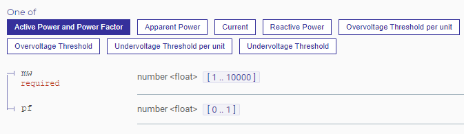

## Summary

The TROLIE Specification defines three primary ways of defining a limit:

* **Active Power** with units of Megawatt (MW) and (optionally) Power Factor
* **Apparent Power** in Megavolt-Amperes (MVA)
* **Current** in Amperes (amps)

A given TROLIE server deployment is only required to support *one* of these
methods. Some implementations may choose to support more than one method, as
well as mix and match them on a per Ratings Provider--or even per facility
(Ratings Obligation)--basis.

Clients must pre-coordinate with their Clearinghouse Provider to determine
which methods are supported for their equipment. The Specification is only
opinionated about how these different types limits are represented and the
runtime behavior when they are not represented as expected.

## Validation

If a proposal received by a TROLIE server is syntactically correct and valid
according to one of the limits schemas, **but** *the units provided are not
supported by the server*, the client shall receive a `422 Unprocessable Entity`
response.

### Example: Server Requires Power Factor for Current

Consider a Clearinghouse Provider that only supports active power (MW) limits and
requires the power factor to be specified. The specification defines active power
to have these properties:



Observe that `pf` is not required by the *schema*, only `mw`, but `pf` *is*
required by the Clearinghouse Provider in our scenario. If a limit is provided
without specifying `pf`, the Ratings Provider client will receive an error
similar to the following.

```http
HTTP/1.1 422 Unprocessable Entity
Content-Type: application/problem+json
Server: trolie.example.com
Date: Wed, 6 May 2025 12:00:00 GMT
X-Rate-Limit-Limit: 100
X-Rate-Limit-Remaining: 98
X-Rate-Limit-Reset: 3600


```

N.b. `detail` should be considered opaque at runtime; it's meant for
debugging only. TROLIE server implementations should be careful to craft helpful
messages client developers who are testing their proposal submission.

## Note to Implementors

The specification uses the `oneOf` construct without an explicit
`discriminator`.  The rationale for this will be discussed elsewhere, but be
advised that code generators will issue warnings on the `limit` schema. In
practice your implementation will only support a couple of these limit types, so
some hand-coding of the relevant DTOs and validations is anticipated in any
event.

## Future Directions

The specification defines additional ways of defining a limit, but these are not
anticipated to be used in the Order 881 implementation time frame. The
maintainers know YAGNI, but it was deemed appropriate to anticipate likely
future scenarios and support these limits in the spec so that the relevant media
types will not need to be versioned.

* Reactive Power in Megavolt-Amperes Reactive (MVAR)
* Overvoltage Threshold in Kilovolts (kV) and (optional) a per-unit factor
* Undervoltage Threshold in Kilovolts (kV) and (optional) a per-unit factor
