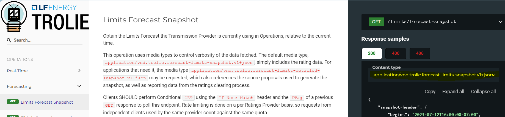
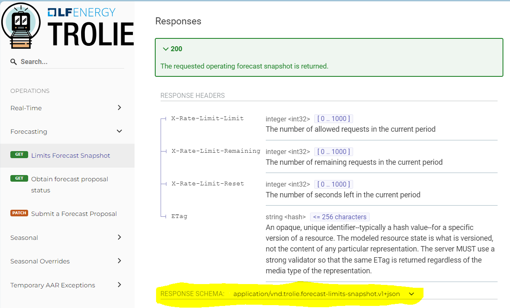

# Media Types
{:.no_toc}

{: .nb }
> For detailed walkthroughs of specific TROLIE use cases, please see
> [Usage Examples](../usage-examples). The article focuses on how the various
> messages required for those use cases are specified in this standard. If you
> are unfamiliar with the use of media types in Web APIs this article is for you.

## Overview
{:.no_toc}

TROLIE specifies an API that makes use of long-standing features of the Web,
including [Conditional GET](./conditional-GET) and the subject of this article:
media types.

> "HTTP uses media types in the Content-Type and Accept  header fields in order
> to provide open and extensible data typing and type negotiation. **Media types
> define both a data format and various processing models**: how to process that
> data in accordance with the message context."
>
> Source [RFC 9110 HTTP Semantics](https://www.rfc-editor.org/rfc/rfc9110.html#media.type)
> (emphasis added)

As an OpenAPI specification, TROLIE uses [JSON
Schema](https://swagger.io/docs/specification/data-models/keywords/) to describe
the data formats of [media
types](https://swagger.io/docs/specification/media-types/), so to define
processing models for these media types, TROLIE only needs to describe the
semantics of the transmitted JSON. The [TROLIE OpenAPI Specification](../spec)
does describe what each of the JSON elements mean, but it also assumes
familiarity with the use of media types in an API. This article aims to give the
reader a map of the kinds of messages that TROLIE specifies to help
contextualize those details.

## TROLIE Media Types
{:.no_toc}

The media types specified by TROLIE for requests and responses--that is, inputs
and outputs--can be organized into a few categories.

* toc
{:toc}

### Read Requests

The following media types are used when reading from a TROLIE server. In other
words, one of these media types are required in the `Accept` header for HTTP
the `GET` requests specified by TROLIE.

For example, here is how you'd use `curl` to request a Forecast Limits Snapshot.

```sh
curl -X GET \
     -H "Accept: application/vnd.trolie.forecast-limits-snapshot.v1+json, */*" \
     $TROLIE_SERVER_URL/limits/forecast-snapshot
```



| `GET` Request Path          | Provided Media Types                                               | Description |
|-----------------------------|--------------------------------------------------------------------|-------------|
| `/limits/forecast-snapshot` | `application/vnd.trolie.forecast-limits-snapshot.v1+json`          | A snapshot of just the forecasted limits for the current operating period. |
| `/limits/forecast-snapshot` | `application/vnd.trolie.forecast-limits-detailed-snapshot.v1+json` | Same as above but adds details about how the limits were determined, including the ratings proposals that were considered. |
| `/limits/realtime-snapshot` | `application/vnd.trolie.realtime-limits-snapshot.v1+json`          | A snapshot of just the real-time limits for the current operating period.|
| `/limits/realtime-snapshot` | `application/vnd.trolie.realtime-limits-detailed-snapshot.v1+json` | Same as above but add details about how the limit were determined, including the ratings proposals that were considered. |

**Note:** the [TROLIE
spec](../spec#tag/Forecasting/operation/getLimitsForecastSnapshot) shows these
media type options in two places for successful responses: the examples sidebar
and the response schema section.




### Data Submittal (Write Requests)

The following media types are used when writing to a TROLIE server. In other
words, one of these media types are required in the `Content-Type` header for
HTTP the `PATCH` and `PUT` requests specified by TROLIE.

For example, here is how you could use `curl` to submit forecasted ratings
assuming the file `forecast.json` was a valid document per the
`application/vnd.trolie.rating-forecast-proposal.v1+json` schema.

```sh
curl -X PATCH \
     -H "Content-Type: application/vnd.trolie.rating-forecast-proposal.v1+json" \
     -d @forecast.json \
     $TROLIE_SERVER_URL/ratings-proposals/forecast
```

*Note* this is a simplified example. In particular the behavior of a TROLIE
implementation is undefined when the `Accept` header is not explicitly populated.
Please see the section [Putting it all Together](#putting-it-all-together) for
details.

|               Request               | Provided Media Types                                            | Description                                           |
|-------------------------------------|-----------------------------------------------------------------|-------------------------------------------------------|
| `PATCH /ratings-proposals/forecast` | `application/vnd.trolie.rating-forecast-proposal.v1+json`       | Used to send ratings forecasts. |
| `POST  /ratings-proposals/realtime` | `application/vnd.trolie.rating-realtime-proposal.v1+json`       | Used to send real-time ratings. |
| `PATCH /ratings-proposals/seasonal` | `application/vnd.trolie.seasonal-ratings-proposal.v1+json`      | Used to send seasonal ratings.  |
| `PATCH /ratings-proposals/seasonal` | `application/vnd.trolie.seasonal-ratings-proposal-slim.v1+json` | Same as above but much more compact, see [Slim Media Types](#slim-media-types) below. |
| `POST  /seasonal-overrides`         | `application/vnd.trolie.seasonal-override.v1+json`              | Used to [override seasonal ratings](../concepts#seasonal-overrides). |
| `PUT   /seasonal-overrides/{id}`    | `application/vnd.trolie.seasonal-override.v1+json`              | Same as above. |
| `POST  /temporary-aar-exceptions`   | `application/vnd.trolie.temporary-aar-exception.v1+json`        | Used to defined a [temporary AAR exception](../concepts#temporary-aar-exception). |
| `PUT /temporary-aar-exceptions/{id}`| `application/vnd.trolie.temporary-aar-exception.v1+json`        | Same as above. |

#### Slim Media Types
{: .no_toc }

{: .nb }
> At the time of this writing,
> `application/vnd.trolie.seasonal-ratings-proposal-slim.v1+json` is the only
> "slim" media type that has been implemented, but others are
> [planned](https://github.com/trolie/spec/issues/152).

The media types in the table above are verbose because they make intentional
trade-offs between efficiency and other qualities. For more information please
review the article [Performance Trade-offs in the TROLIE Schema Design](./tradeoffs).

Because the TROLIE specification chose to [leverage media types to evolve the
interface](../decision-log/media-type-versioning), the project was able to
implement a "slim" media type use for seasonal ratings,
`application/vnd.trolie.seasonal-ratings-proposal-slim.v1+json`, that
complements `application/vnd.trolie.seasonal-ratings-proposal.v1+json`. This
"slim" format is much more space-efficient but requires a few processing steps
and assumptions:

1. The `limit-type` used in the proposal is specified by the Ratings Provider as
a parameter of the media type. The `limit-type` chosen determines the layout of
the ratings values.
2. The ratings are provided in order of decreasing duration, e.g., continuous
then emergency then load shed.
3. The facilities are required to be in the same order they appear in the
header.
4. The seasons are required to be in the same order they appear in the header.
5. Each forecast must have the number of hourly forecasts corresponding to the
new header field hours with the assumption that the begins header is the first
entry and each subsequent entry represents the subsequent hour's forecast.

This is discussed in further detail in the
[spec](../spec#schema/seasonal-proposals-slim). Here we can breakdown a concrete
example. We'll start with a `curl` request, then discuss the HTTP request itself
in two parts, the headers then the JSON payload.

##### `curl` Example
{: .no_toc }


```sh
curl -X PATCH \
     -H "Content-Type: application/vnd.trolie.seasonal-ratings-proposal-slim.v1+json; limit-type=apparent-power" \
     -H "Accept: application/vnd.trolie.seasonal-ratings-proposal-status.v1+json, */*" \
     -d @seasonal-ratings.json \
     $TROLIE_SERVER_URL/ratings-proposals/seasonal
```

{: .important }
> The `limit-type` parameter in the `Content-Type` header (line 2 above) is
> required by the TROLIE specification for the
> `application/vnd.trolie.seasonal-ratings-proposal-slim.v1+json` media type, as
> no default `limit-type` can be assumed. See [Limit
> Types](../spec#tag/limit-type) for the other options defined in the spec.

{: .nb }
> The `Accept` header in this example specifies one of the 
> [Status Responses](#status-responses).

##### HTTP Headers
{: .no_toc }

The previous `curl` request would result in an HTTP request like the following:

```http
PATCH /ratings-proposals/seasonal HTTP/1.1
Host: trolie.example.com
Accept: application/vnd.trolie.seasonal-ratings-proposal-status.v1+json, */*
Content-Type: application/vnd.trolie.seasonal-ratings-proposal-slim.v1+json; limit-type=apparent-power
```

##### Payload
{: .no_toc }

{: .important }
> For illustrative purposes here, we present the JSON payload with inline
> comments.  However, comments are **not** permitted in the TROLIE media types.

```jsonc
{
  "proposal-header": {
    "source": { /* ...details elided for clarity... */ },
    "default-emergency-durations": [
      { "name": "emergency", "duration-minutes": 240 },
      { "name": "load shed", "duration-minutes": 15  }
    ],
    "power-system-resources": [
      { "resource-id": "8badf00d",
        "alternate-identifiers": [ { "name": "segmentX", "authority": "TO-NERC-ID" } ]
      }, {
        "resource-id": "f34d3d",
        "alternate-identifiers": [ { "name": "segmentY", "authority": "TO-NERC-ID" } ]
      }
    ],
    "default-seasonal-schedule": {
      "schedule": [
        { "season-name": "WINTER", "begins": "2024-11-15T00:00:00-05:00" },
        { "season-name": "SPRING", "begins": "2025-03-01T00:00:00-05:00" },
        { "season-name": "SUMMER", "begins": "2025-06-15T00:00:00-05:00" },
        { "season-name": "FALL",   "begins": "2025-09-01T00:00:00-05:00" }
      ],
      "ends": "2025-11-15T00:00:00-05:00"
    }
  },
  "ratings": [
    // note all values are assumed to be MVA because the header in this example
    // Content-Type: application/vnd.trolie.seasonal-ratings-proposal-slim.v1+json; limit-type=apparent-power
    // specifies the apparent-power limit type which has a single value of MVA
    // see https://trolie.energy/spec#tag/limit-type

    [ // resource-id: 8badf00d
      [ // season-name: WINTER
        160, //continuous MVA
        170, //emergency MVA
        200, //load shed MVA
      ],
      [ // season-name: SPRING
        155, //continuous MVA
        160, //emergency MVA
        200  //load shed MVA
      ],
      [ // season-name: SUMMER
        145, //continuous MVA
        150, //emergency MVA
        200  //load shed MVA
      ],
      [ // season-name: FALL
        155, //continuous MVA
        160, //emergency MVA
        200  //load shed MVA
      ]
    ],
    [ // resource-id: f34d3d
      [ // season-name: WINTER
        161, //continuous MVA
        171, //emergency MVA
        201  //load shed MVA
      ],
      [ // season-name: SPRING
        156, //continuous MVA
        161, //emergency MVA
        201  //load shed MVA
      ],
      [ // season-name: SUMMER
        146, //continuous MVA
        151, //emergency MVA
        201  //load shed MVA
      ],
      [ // season-name: FALL
        156, //continuous MVA
        161, //emergency MVA
        201  //load shed MVA
      ]
    ]
  ]
}
```

### Status Responses

As noted in the previous example, the response provided by a TROLIE implementation
to a *successful* data submittal (write request), i.e., a `POST` or `PATCH` is
a one of a few specific media types:

|               Request               | Media Types for Successful Response                               |
|-------------------------------------|-------------------------------------------------------------------|
| `PATCH /ratings-proposals/forecast` | `application/vnd.trolie.rating-forecast-proposal-status.v1+json`  |
| `POST  /ratings-proposals/realtime` | `application/vnd.trolie.rating-realtime-proposal-status.v1+json`  |
| `PATCH /ratings-proposals/seasonal` | `application/vnd.trolie.seasonal-ratings-proposal-status.v1+json` |

{: .important }
Clients *MUST* specify the status response media type they are expecting in the
`Accept` header.  Note that these media types are versioned, so we cannot use
`Accept: application/json` or `Accept: */*` without ambiguity as to the version
that the client supports. For additional details on this versioning strategy see
[Versioning through Media Types](../decision-log/media-type-versioning.md).

### Problems

For all error responses, i.e., for any HTTP response code in
400-599, where the specification defines a non-empty response body, we use the
media type defined by [RFC 9457](https://www.rfc-editor.org/rfc/rfc9457):
`application/problem+json`.

Here's an example of a problem response:
```http
HTTP/1.1 409 Conflict
Content-Type: application/problem+json


```

Note some headers were elided for clarity.

## Putting it all Together
{: .no_toc }

In this article we've established that TROLIE specifies particular media types
for both requests and responses for each operation it defines. Finally we
present a complete request to illustrate the required use of media types in both
the `Accept` and `Content-Type` headers. 

### Request
{: .no_toc }

```sh
curl -X PATCH \
     -H "Content-Type: application/vnd.trolie.rating-forecast-proposal.v1+json" \
     -H "Accept: application/vnd.trolie.rating-forecast-proposal-status.v1+json, application/problem+json" \
     -d @forecast.json \
     $TROLIE_SERVER_URL/ratings-proposals/forecast
```
