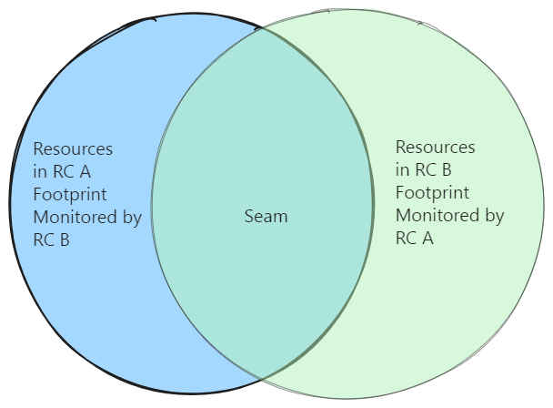
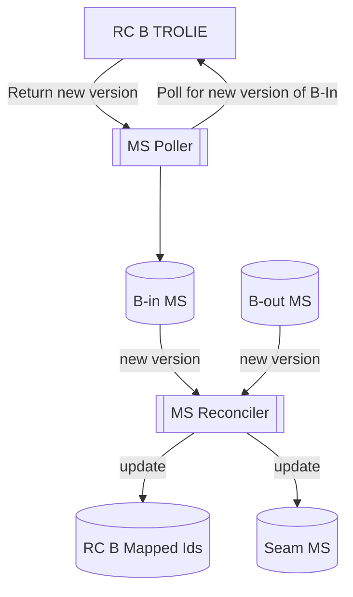

# Peer TROLIEs

In TROLIE's simplest usage, rating providers send rating proposals to Transmission Providers
using the workflow described in [Forecast Submittal](../example-narratives/submitting-forecasts.md).  

However, two neighboring Transmission Providers, each running independent clearinghouses, will also
have to share ratings.  Each TROLIE server must be able to act as a client to achieve this coordination, 
with each reaching out to one another.  

This article specifically covers coordination of resource models on the seam between reliability 
coordinators, or really any two TROLIE implementations that can act as peers.  It uses each RC's 
default monitoring sets as a foundation for discovery of mapped models.  

This article defines a design pattern recommended as a best practice, as it ultimately must 
be implemented within TROLIE servers and is only supported by the TROLIE communications specification 
rather than mandated by it.  

# Coordinating Models and Identifiers
The data exchange specified by TROLIE implies that any two parties must both agree on identifiers for 
[Power System Resources](../concepts.md#power-system-resource-or-simply-resource).  This is required for 
the exchange to function.  

However, this creates a significant burden on modelers to maintain.  Each reliability coordinator will
almost always have different identifiers for the resources within their footprint across different 
systems.  Modelers will have to maintain some alias identifiers for resources so that they may be 
mapped to the external RC's system.  Some of this complexity is unavoidable.

# Peers and Monitoring Sets

TROLIE servers can mitigate some of this complexity by introspecting monitoring 
sets.  The Venn diagram below illustrates two [monitoring sets](../concepts.md#monitoring-sets) owned 
by RCs (A and B), one in each of the other's TROLIE servers.  Each RC must coordinate creation of 
monitoring sets in the other's TROLIE in order to monitor ratings, as described in the operations 
[getLimitsForecastSnapshot](../spec#tag/Forecasting/operation/getLimitsForecastSnapshot) and
[getRealTimeLimits](../spec#tag/Real-Time/operation/getRealTimeLimits).



As indicated by the diagram, the actual seam between the RCs can be derived where the two monitoring sets
overlap.  For these resources, both RCs are producing a rating.  

# Monitoring Set Reconciliation Process

Consider the perspective of RC A given the above diagram.  RC A must be aware of both its own monitoring set
in RC B's TROLIE, which will be referred to as monitoring set `B-in` in the following examples.   In addition,
The RC A TROLIE can gain insight by specifically being aware of the monitoring set in its own database that 
RC B is using to monitor RC A's footprint.  This will be referred to as `B-out` in the following examples.  

Visibility into the monitoring set itself in either system is exposed via the 
[getMonitoringSet](../spec#tag/Monitoring-Sets/operation/getMonitoringSet) operation.  Given this capability, 
TROLIE for RC A may do the following:

* Automatically determine the overlapping aliases between models. 
* Automatically derive the actively configured seam between RCs, to use for debugging and monitoring.

This automation should be triggered by an update to either the `B-in` or `B-out` monitoring 
sets.  The process to update `B-out` is an implementation internal.  Updates to `B-in` are 
facilitated by an independent polling mechanism in the RC A TROLIE, using the 
[conditional GET](./conditional-GET.md) pattern against `getMonitoringSet`.  When 
`getMonitoringSet` returns a 200 status (as opposed to 304), indicating a new version, then this triggers 
reconciliation.  This is illustrated in the data flow below.  Note that "Monitoring Set"
is abbreviated to "MS" for readability.    



The above diagram illustrates two outputs of a reconciliation process, both of which should be
stored in the TROLIE server's database:

* Mappings of remote identifiers (the identifiers expected by RC B in this case)
* The seam monitoring set

# Automatic Resource Alias Mapping
In practice, most Transmission Providers have at least the following identifiers for each resource:

* An identity for the resource in a modeling system and/or asset registration system.  Since many modeling tools are CIM-based, this is typically a master resource identifier (mRID) in the form of a UUID.  
* An identity for the resource in an EMS system.  These may be the same as the modeling system identities, but since most EMS technologies pre-date CIM modeling practices, they typically do not.  Instead, they often follow some convention established by the specific EMS technology in combination with company-specific naming conventions and modeling practices.  

As discussed above, typically none of these identifiers are the same across grid operators.  Also, each 
RC could decide to use either as their "primary" value for `resource-id` in TROLIE operations.  

Naively, each RC could track the primary `resource-id`s used by the other.  So, for example, 
RC A could track RC B's EMS IDs in its database mapped to it own internal ones, and then ensure that
those EMS IDs are explicitly used (and expected back) whenever it interacts with RC B's 
TROLIE.  RC A would have to do something similar for all other neighbors.  

This approach is functional and perfectly valid.  However, it presents some challenges:

* If both RC A and RC B were to use this approach, then each would have to manually maintain copies of one another's IDs.  
* RC A would have to either hard-code or manually configure each peer so that they know which set of IDs apply to that peer.  

Using monitoring set reconciliation however, any unique identifier may be shared.  This could mean only 
one of the RCs maintaining an alias.  Alternatively, RCs that are using ICCP for real-time 
communications must already coordinate point names for sending the ratings.  Using the point name as one of 
the aliases allows it to be reused to map resources.  Consider the following example contents for monitoring sets
as returned by [getMonitoringSet](../spec#tag/Monitoring-Sets/operation/getMonitoringSet) for `B-in` and `B-out` 
respectively.  Note these examples are oversimplified for readability, as they both only contain a single resource:

**`B-in`**:

```json

```

**`B-out`**

```json

```

The IDs used by RC A and B are very different.  The MRIDs are of course different.  The EMS IDs also use different
naming conventions.  Also, RC B has chosen to use CIM MRIDs as their `resource-id`, whereas RC A has chosen to 
use EMS IDs as their `resource-id`.  

However, when querying a new version of `B-in`, monitoring set reconciler function in the RC A TROLIE can see that 
one of the aliases, specifically the ICCP point name "DLR_OUT_LINE_5742_NORM" matches another alias it has in its 
database, with the matching name type and authority.  The reconciler function can then determine that the resource 
RC-A refers to as "e300d2c2-45bb-49f6-a3bc-a3e5d5a30ce6" may be referred to as "MYSUBST-LINE-5742" whenever it 
interacts with RC B's TROLIE.  It should store this mapping and assume it on all future calls.  

# Seam Monitoring Sets 
The seam monitoring set, as described above, would be derived by finding the overlap between `B-in` and 
`B-out`.  This monitoring set has various uses in monitoring system behavior:

* If the TROLIE implementation pre-configures the expected seam, then this configuration may be checked against the seam modeling set for differences, therefore spotting modeling errors.  
* In future articles, we will show how the seam monitoring set may be used to monitor reconciliation of ratings across RCs.  