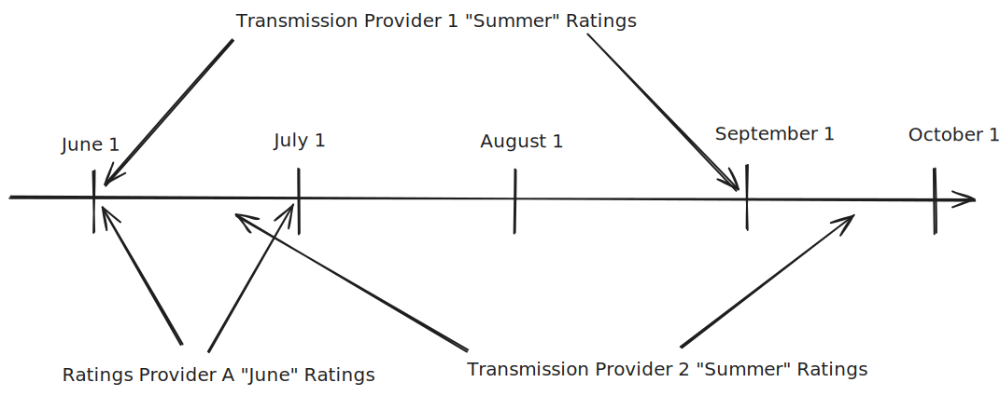

## Status

* Status: `accepted`
* Issue Link: [GitHub Issue](https://github.com/trolie/spec/issues/14)

## Context

While the primary focus of FERC 881 is AARs, the [seasonal ratings](../concepts.md#seasonal-ratings) 
still play an important role.  In practice, these are used in planning and other non-operational studies
in addition to their role as recourse ratings in operations.  

Today, seasonal ratings are managed using various tools, and often tied to network model update processes.  For various
reasons, many of these tools and processes will need to continue to be supported as they are today.  However, 
FERC 881 creates a practical need to be able to share these ratings in a more structured way, implying that
some support for seasonal ratings makes sense in TROLIE, even if it is optional.  

However seasonal rating interop is challenging, because the definition and meaning of each season differs 
between grid operators.  The definition for [seasons](../concepts.md#seasons) in the FERC 881 context is
quite flexible.  While internally, grid operators may assign seasonal ratings to well-known named seasons 
such as `Fall`, the practices around `Fall` ratings can differ significantly between grid operators:

* Assumed start and end dates can be different.
* The FERC order specifies only that they must be updated _at least_ annually.  In practice, the times they may be changed can be different.

The diagram below illustrates an example of rating providers with different season definitions.  Consider the challenges 
for `Transmission Provider 1` to exchange seasonal ratings with `Ratings Provider A` and `Transmission Provider 2`:

This decision record describes seasonal rating support in TROLIE.  

## Decision

TROLIE will add support for a seasonal clearinghouse, using the same pattern as used by forecasted and 
real-time ratings.  Support for either accepting proposals or querying snapshots is technically optional, 
although it is likely most Transmission Providers must support at least sharing 
their snapshots of in-use seasonal ratings.  In practice, clearinghouse implementations may take seasonal proposals, 
seasonal ratings from modeling systems, seasonal ratings from other systems, or any combination of these into account.  

The familiar TROLIE concepts of proposals, 
snapshots and a clearinghouse have multiple benefits for seasonal ratings:

* While there are no EMS operator overrides or topology conditions to consider like there would be with AARs, there are still jointly-owned facilities and tie lines where multiple ratings may be submitted by different Ratings Providers.  
* Some Transmission Providers may elect to manually validate proposed seasonal ratings before using them, as is common in existing practices.  The distinction between proposal and in-use snapshot provides a discrete step in the overall data flow where such manual validation may be inserted if desired.  

### Defining Seasonal Ratings by Date Instead of Season Names

Seasonal ratings in TROLIE will always be defined via start and end dates, rather than named seasons such 
as `Fall` or `Summer`.  This way, the definition of what a rating provider is 
submitting or a transmission provider is presenting
can be more transparent and precise, and is not explicitly coupled to any one entity's 
choices as to their season definitions.  

The pre-defined "named" seasons that are included in proposal and snapshot definitions are included in headers, 
but only provided as interop debugging hints.  

### Alignment of Seasons and Flexibility of TROLIE Server Implementations
Defining seasonal ratings in terms of start and end dates creates great flexibility in the shape of seasonal ratings that may be exchanged.  

However, the specification explicitly **does not** imply that TROLIE servers **must** accept 
seasonal ratings of any arbitrary start and end date at any time.  Transmission Providers 
implementing TROLIE are ultimately free to decide how flexible they want to be.  

For example, a Transmission Provider may choose only to accept seasonal ratings that 
match that Transmission Provider's pre-defined season start and end dates.  Proposals 
 for these seasons may then need to submitted before some cut-off time determined by 
 the implementer.  Such proposals may be rejected using an HTTP 422 response, in
 much the same fashion to forecasts.  

TROLIE server implementations may reject proposals that do not adhere to the Transmission 
Provider's business rules and practices.  

## Consequences

Seasonal rating support is implemented in the TROLIE [specification](../spec#tag/Seasonal).
