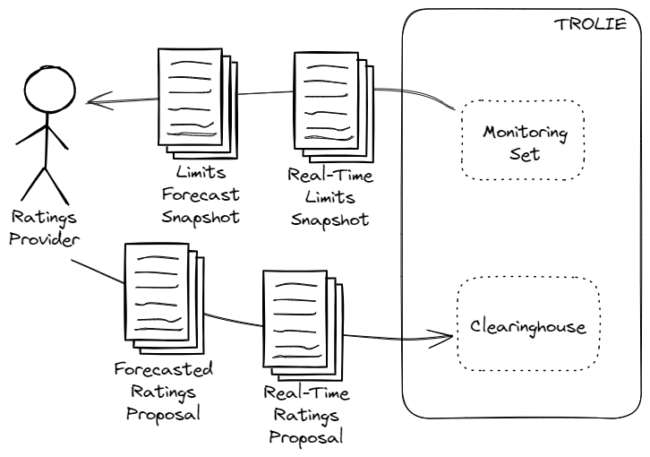

# Reconciliation with Limit Snapshots

A central concept in TROLIE is the Clearinghouse. [Ratings
Providers](../concepts#ratings-provider) propose ratings, and the [Clearinghouse
Provider](../concepts#clearinghouse-provider) determines operating limits:
**ratings in, limits out**.



Crucially, the limits determined by the Clearinghouse Provider may differ from
the ratings proposed by any individual Ratings Provider.  In this article we
will briefly describe the API affordances that support reconciliation of limits
(produced by the Clearinghouse) with the ratings proposed by the Ratings
Provider. Our example with focus on real-time ratings, but the basic approach
applies to forecast ratings as well.

We have discussed [Real-Time Rating Submittal](submitting-realtime-ratings) and
[Querying in-use Real-Time Limits](in-use-realtime-limits) elsewhere. Here we
will focus on making use of the provenance information in
`application/vnd.trolie.realtime-limits-detailed-snapshot.v1+json`. For more
details on the different response messages available in TROLIE, see the article
on [Media Types](../articles/media-types#read-requests).


#### Request
```bash
curl -H "Accept: application/vnd.trolie.realtime-limits-detailed-snapshot.v1+json" \
  $TROLIE_SERVER_URL/limits/realtime-snapshot?monitoring-set=my-monitoring-set
```

#### Response

Some headers are elided for clarity, but a successful response will start with:

```http
HTTP/1.1 200 OK
Content-Type: application/vnd.trolie.realtime-limits-detailed-snapshot.v1+json
```

Here's an example of the body of the response:

```json

```

#### Discussion

The `proposals-considered` array contains the salient details of the ratings
proposals that were considered.  Note that in this example the continuous,
"lte", and "ste" limits were determined by UTILITY-A but the "dal" limit was set
by UTILITY-B.
