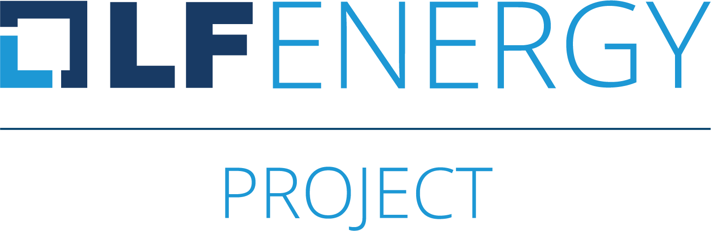

# {{site.data.openapi-split.info.title}}

For general announcements and discussion, subscribe to our [Email List <i
class="fa-solid fa-envelope"></i>](https://lists.lfenergy.org/g/trolie-general).

***

{: .announcement }

> **Latest Updates** <i class="fa-solid fa-bullhorn"></i>
>
> The TROLIE maintainers are pleased to announce that the [Forecasting API](/spec#tag/Forecasting) specification is stable.
> Read more in the [milestone announcement](./community-events/20240330-Forecasting-API-stable).
>
> If you are new to the project, consider watching the replay of the [Intro to TROLIE webinar](./community-events/20240221-Intro-to-TROLIE)

# Introduction

With FERC Order 881, North American Transmission Owners, Transmission Operators,
Transmission Providers, and Reliability Coordinators must establish a means to
exchange ratings information based on current and forecasted ambient conditions.
There is no standards body with a mandate to define a technical specification
for that exchange and no vendor consortium that is working toward a
specification.

TROLIE started as a [MISO](https://www.misoenergy.org/) and [GE
Vernova](https://www.gevernova.com/) collaboration and is now an [LF Energy
project](https://lfenergy.org/projects/trolie/). Most organizations involved in
the operation of the transmission system in North America now need to exchange
ratings and related information in an automated, frequent manner. This project
will help accelerate their implementation and simplify interoperability.

The project’s specific aims are:

* <i class="fa-solid fa-hammer"></i> In Progress: Define an API specification
  for the exchange of ratings and ratings-related information to support
  organizations working to comply with FERC Order 881.

* <i class="fa-solid fa-calendar-check"></i> TODO: A conformance program to
  provide vendors a means to demonstrate their compatibility with the above
  specification and signal their commitment to maintaining compatibility.

* <i class="fa-solid fa-calendar-check"></i> TODO: An open commons for the
  development of clients of the API specification.

We are committed establishing a vendor-neutral specification and building an inclusive community.
