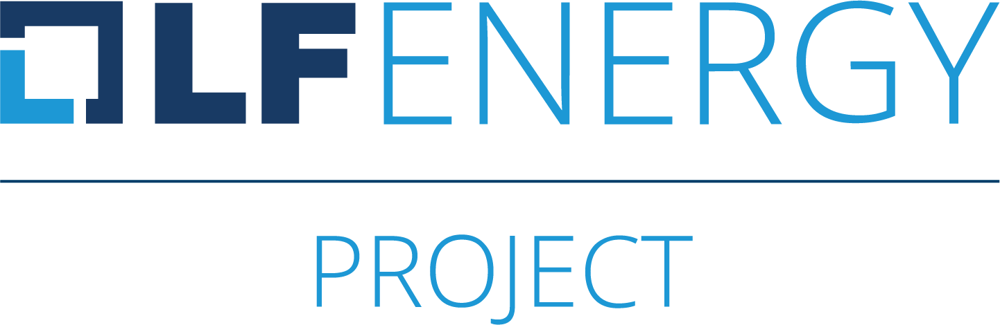
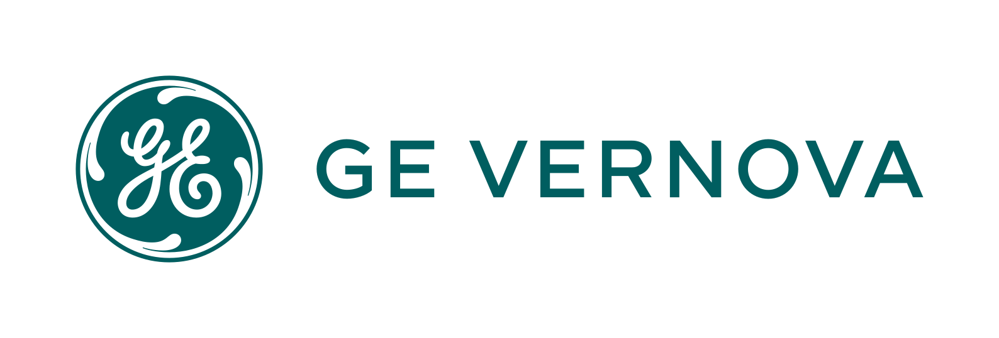

# Transmission Ratings and Operating Limits Information Exchange (TROLIE)

For general announcements and discussion, subscribe to our [Email List <i
class="fa-solid fa-envelope"></i>](https://lists.lfenergy.org/g/trolie-general).

***

{: .announcement }

> **Latest Updates** 📢
>
> <i class="fa-regular fa-bell"></i> 
> Monthly TROLIE meetings are now public
>
> Join us at on the links from the [Linux Foundation calendar](https://zoom-lfx.platform.linuxfoundation.org/meetings/trolie?view=month).
>
> <i class='fa-brands fa-github fa-fw'></i> Also, check out the the latest release of
> the [Java client SDK for TROLIE](https://github.com/trolie/java-client-sdk/releases/latest).

# Introduction

With FERC Order 881, North American Transmission Owners, Transmission Operators,
Transmission Providers, and Reliability Coordinators must establish a means to
exchange ratings information based on current and forecasted ambient conditions.
There is no standards body with a mandate to define a technical specification
for that exchange and no vendor consortium that is working toward a
specification.

TROLIE started as a [MISO](https://www.misoenergy.org/) and [GE
Vernova](https://www.gevernova.com/) collaboration and is now an [LF Energy
project](https://lfenergy.org/projects/trolie/). Most organizations involved in
the operation of the transmission system in North America now need to exchange
ratings and related information in an automated, frequent manner. This project
will help accelerate their implementation and simplify interoperability.

The project’s specific aims are:

* ✅ Define an API specification
  for the exchange of ratings and ratings-related information to support
  organizations working to comply with FERC Order 881.

* <i class="fa-solid fa-hammer"></i> In Progress: A [conformance
  program](https://github.com/trolie/conformance) to
  provide vendors a means to demonstrate their compatibility with the above
  specification and signal their commitment to maintaining compatibility.

* ✅ An open commons for the
  development of clients of the API specification.  

We are committed establishing a vendor-neutral specification and building an inclusive community.

### TROLIE is supported and adopted by leading companies in the electric power industry of North America

  

